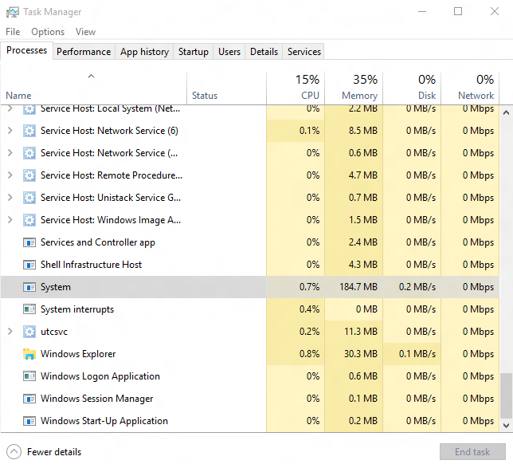

# Windows 10: Memory Compression

With the announcement of the Memory compression feature, we have received a lot of queries from the insiders asking for more information. This post tries to go in-depth into the inner working of the Memory Manager and the memory compression engine built within it. 

One of the primary goals of any operating system is to manage and share resources efficiently. How well an operating system arbitrates competing memory requirements is particularly important, because it impacts the user’s perception of system responsiveness. 

In Windows 10, we enabled the Memory Manager (MM) to compress infrequently-accessed memory pages which reduces the amount of reads and writes to the disk (pagefile) and therefore improves responsiveness. By compressing memory we reduce the amount of memory used per process, allowing the operating system to maintain more applications in physical memory at a time before enacting traditional paging. 

When Memory Manager’s policy does dictate paging, the data being written to or read from the disk is already compressed to typically around 40 percent of its original size. This compression improves the performance of other unrelated operations on the system by reducing a major source of interfering IO load. The end result is a snappier, more responsive experience with improved app launch performance and consistency.

Before explaining the Windows 10 changes in detail, I’ll describe some of the fundamental concepts in Windows memory management and give an overview of how it was performed prior to implementing compression.

The first concept is a **working set** which is the actively-used physical memory of a process. A private working set represents physical memory that is unique to a process. Processes also touch other pages of physical memory that are “shared,” which several processes can reference. When you look at the Processes view in Task Manager, the memory for a specific process is actually its current private working set. Note that for simplicity when I refer to a “working set” in this post, I mean a “private working set.”

Some subset of a process’s working set pages are likely to be used only infrequently, and since memory is a limited resource that needs to be used efficiently, those pages must be reclaimed and made available for use by other processes. When MM decides a page has been inactive for long enough, it puts it on the **modified list**. An asynchronous process writes pages in the modified list to the pagefile on disk and then - in memory - moves them from the modified list to the **standby list**. This write happens so that if the memory is reclaimed from the standby list by another process, but the original process comes looking for its page, the data can be retrieved from the pagefile.

However, pages on the standby list haven’t yet been reclaimed, so they retain their data until MM repurposes them for another process’s working set. They can be reused by the app that previously owned them if that app asks for the page before it is reclaimed. This is called a **soft fault**. But if a page has been repurposed, and the original process asks MM for that page, a **hard fault** occurs. The original process is now asking for memory that has been taken by another process, and the OS must issue disk read IO to retrieve it.

As explained earlier, MM, when faced with memory pressure, determines which pages should be moved to the modified list. This is called **trimming**. But Windows 8 added the ability for Universal Windows Platform (UWP) applications to be **swapped** out in their entirety - i.e. at app rather than at page granularity. This is done because UWP apps are suspended when not in the foreground meaning they won’t be running until the user switches back them. No page will be touched until the app is brought back in its entirety, so it’s safe to swap out the whole application. The disk IO required to swap the application back in is then entirely **sequential reads**, which are dramatically faster than random reads. For more information about the swapping of UWP apps in Windows 8 MM, see [this blog post by Bill Karagounis](http://blogs.msdn.com/b/b8/archive/2012/04/17/reclaiming-memory-from-metro-style-apps.aspx).

Windows 10 introduces a layer between the pagefile and normal paging activity which allows for the compression of all pages moved to the modified list. This means that when MM feels memory pressure, it will compress unused pages instead of writing them to disk. MM now only performs disk IO when compression isn’t enough to relieve memory pressure. Using this strategy, fewer disk operations are required since - thanks to compression - more data can be stored in memory than before.

This is achieved by using a concept called a **compression store**, which is an in-memory collection of compressed pages. There’s a single system store for legacy Windows desktop apps or any other non-UWP app memory usage, and then one store for each Windows Runtime app (in order to enable trimming and swapping accordingly). Instead of writing pages in the modified list to the pagefile, MM compresses them and places them in the appropriate store.

The stores live in the **system process’s working set**. Note that in the diagram above we’ve displayed the System Working Set separately from the other Working Sets for formatting reasons, but the System Working Set is a working set like any other. Though perhaps counterintuitive at first glance, since the system process holds the stores in memory, its working set grows larger exactly when memory is being made available to other processes. This is visible in the task manager.

First, observe the amount of memory used by the System process:

Then, start and suspend some applications:

And the System process’s working set will grow:

Each store manages fragmentation by compacting itself when necessary to ensure a good compression ratio. In practice, compressed memory takes up about 40% of the uncompressed size, and as a result on a typical device running a typical workload, Windows 10 writes pages out to disk only 50% as often as previous versions of the OS did. This will reduce the amount of time spent waiting for IO on all devices, but it will also improve the expected lifespan of systems featuring flash-based hard drives.

Though compression affords the OS more space in memory for a given application load, paging to disk may still be necessary. In Windows 10, this works by moving pages from the stores in the system process to the modified list. If pages come to the modified list from the system process stores, MM knows they’ve already been compressed and are ready to be written to the pagefile. The writes to disk will be smaller since the pages are necessarily compressed, i.e. the only pages MM will write to disk are ones which have been compressed and stashed in a store in the system process.

So now let’s talk about how a process gets its data back either from a compression store or from the pagefile on disk. In the former case where a process faults on a page which is currently in a compressed store, MM simply decompresses the page and puts it back in the requesting process’s working set - a soft **compression fault**. But in the latter case, MM tries the former and finds that the compressed data for the page is not in memory. The system process working set then hard faults on the compressed data for the 

page and MM reads it back in from disk. Decompression and adding to the faulting process’s working set follow.

Decompression is a highly parallelizable operation, so Windows can be efficient when moving multiple pages at once. Because of that, swapping UWP applications (as opposed to trimming) performs particularly well. But it’s not just the decompression: Windows combines that parallelizability with the sequential reads designed into the swapping procedure to read pages into memory extremely quickly; it reads a block at a time, and, while waiting for the next IO operation to complete, it’s simultaneously decompressing the data it just read in parallel using multiple CPUs. Where before a platform might have felt sluggish due to the transfer rate of its disk, running Windows 10 the same hardware appears much more responsive.

In summary, Memory compression allows Windows 10 to make better use of available memory on all systems by reducing physical memory utilization, resulting in fewer pagefile IO operations and a reduced reliance on disk. Furthermore, it improves the speed of writing to and reading from disk when MM determines paging must be enacted. In sum, we expect users to experience improved overall responsiveness and usability on all devices running Windows 10.

Thanks,

Ethan Creeger – Program Manager in the Base Platform team. I have been in Windows (and Microsoft) for two years work on the hardware aspects of the Kernel such as ACPI and PCIE.